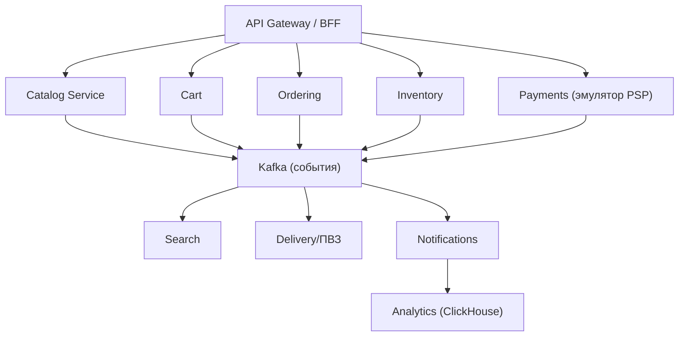

# Маркетплейс «Bazaar»

```mermaid
graph TD
    APIGateway[API Gateway / BFF] --> CatalogService[Catalog Service]
    APIGateway[API Gateway / BFF] --> CartService[Cart]
    APIGateway[API Gateway / BFF] --> OrderingService[Ordering]
    APIGateway[API Gateway / BFF] --> InventoryService[Inventory]
    APIGateway[API Gateway / BFF] --> PaymentsService["Payments (эмулятор PSP)"]
    CatalogService --> Kafka["Kafka (события)"]
    CartService --> Kafka["Kafka (события)"]
    OrderingService --> Kafka["Kafka (события)"]
    InventoryService --> Kafka["Kafka (события)"]
    PaymentsService --> Kafka["Kafka (события)"]
    Kafka["Kafka (события)"] --> SearchService[Search]
    Kafka["Kafka (события)"] --> DeliveryService["Delivery/ПВЗ"]
    Kafka["Kafka (события)"] --> NotificationsService["Notifications"]
    NotificationsService["Notifications"] --> AnalyticsService["Analytics (ClickHouse)"]

```